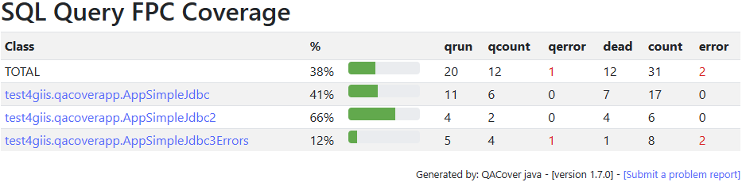
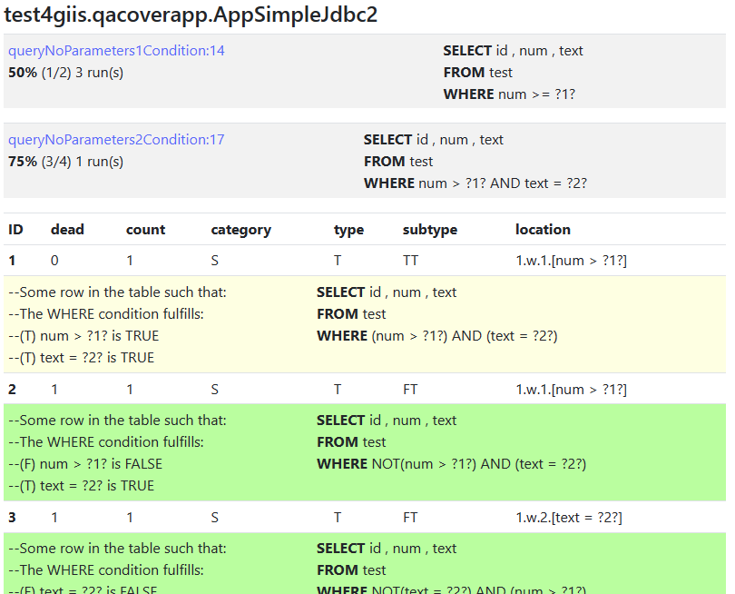
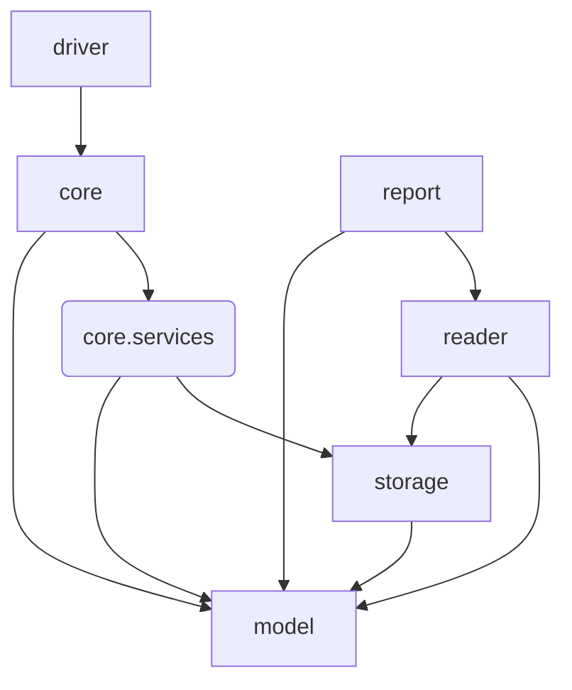

[](https://github.com/giis-uniovi/qacover/actions)
[](https://sonarcloud.io/summary/new_code?id=my%3Aqacover)
[](https://giis-uniovi.github.io/qacover/junit-noframes/junit-noframes.html)
[-orange)](https://giis-uniovi.github.io/qacover/junit-frames/index.html)
[](https://central.sonatype.com/artifact/io.github.giis-uniovi/qacover-core)
[](https://www.nuget.org/packages/QACover/)

# QACover - SQL Query Aware Test Data Coverage Evaluation for Java and .Net applications

*QACover* is a component to evaluate the test data coverage in relation to the
SQL queries that are executed in a Java or .NET application.
The coverage is measured according to the *SQL Full Predicate Coverage* (SQLFpc) criterion,
a variant of MCDC tailored to SQL queries.
The criterion determines the situations of interest (test coverage items) 
to test a SQL query against the test database. 
These situations are represented as a set of *Coverage Rules*.

Each time that the application executes a query, QACover intercepts the query execution, 
generates and evaluates the coverage rules, and stores the results in the local development environment.

At the end of the tests you can get the summary and detail reports of test data coverage.
This is an example of the summary report of a test session:



## Contents
  
  - [Quick Start](#quick-start)
  - [Example scenario](#example-scenario)
  - [QACover Components](#qacover-components)
    - [Java Dependencies in Maven Central](#java-dependencies-in-maven-central)
    - [.NET Packages in NuGet](#net-packages-in-nuget)
  - [Configuration](#configuration)
    - [QACover configuration file](#qacover-configuration-file)
    - [P6Spy configuration file](#p6spy-configuration-file)
    - [Configuration for .NET](#configuration-for-net)
  - [Logging](#logging)
  - [Reporting](#reporting)
    - [Report generation](#report-generation)
    - [Content of the reports](#content-of-the-reports)
  - [Contributing and Architecture](#contributing-and-architecture)

## Quick Start

Example for Java:

- Add the dependency 
  [`qacover-core`](https://central.sonatype.com/artifact/io.github.giis-uniovi/qacover-core/1.5.0/overview) to your pom.xml
- Copy the files  
  [`qacover.properties`](qacover-core/qacover.properties) and 
  [`spy.properties`](qacover-core/spy.properties) from the `qacover-core` folder to the root of your project.
- Edit the connection string of your application and insert `:p6spy` afer `jdbc`
  (eg. if your connection string is `jdbc:sqlite:./target/TestDB.db` it must become `jdbc:p6spy:sqlite:./target/TestDB.db`).
- Run your tests and wait to finish.

This creates the folder `target/qacover/rules` that contains the internal data about the coverage evaluation.
To generate an html report:

- Download the *the standalone reporter jar file*
  [`qacover-model-<VERSION>-report.jar`](https://central.sonatype.com/artifact/io.github.giis-uniovi/qacover-model)
  from Maven Central (go to Versions and then Browse the selected version to download).
- Run 
  ```bash
  java -jar qacover-model-<VERSION>-report.jar  target/qacover/rules  target/qacover/reports
  ``` 
  from the root of your workspace.
- Open the `index.html` that you will found in the `target/qacover/reports` folder.

If you find that the class names are not the ones at the interaction point that executes the query, 
you will need to tweak the configuration to include some exclusions for their packages
(see later), remove the `target/qacover` folder and repeat again.

## Example scenario

Folder with the test package [qacoversample](qacover-core/src/test/java/test4giis/qacoversample)
contains an example of how to use the coverage information to improve the test data and test cases
to reveal hidden bugs. It contains three sequential scenarios:

1. Execute test cases and let QACover to evaluate the test coverage. 
   Test data was designed to cover a number of test situations that were manually determined. All tests pass.
2. Use the test coverage information to automatically determine uncovered situations
   to complete the previous test data and the test cases. This allows revealing two hidden faults.
3. Final debug and fix.

## QACover Components

### Java Dependencies in Maven Central

Releases of the java artifacts (java 8 or higher) are published in Maven Central under the group id `io.github.giis-uniovi`.
There are two different artifacts:

- [`qacover-core`](https://central.sonatype.com/artifact/io.github.giis-uniovi/qacover-core):
  The main artifact to use as a a dependency in your application  (as shown in the Quick Start).
- [`qacover-model`](https://central.sonatype.com/artifact/io.github.giis-uniovi/qacover-model):
  It only includes the model and classes to do reporting and to inspect the coverage rules.
  Use it if you only need access to previously generated coverage rules (e.g. to generate reports from a program).

Each of them has another downloadable jar that includes additional qualifier:

- [`qacover-core` uber jar](https://central.sonatype.com/artifact/io.github.giis-uniovi/qacover-core).
  It includes all needed dependencies (excluding `slf4j``) and they are *shaded*
  (i.e. renamed in a different namespace to avoid dependency conflicts):
  - Download the artifact with the `-uber` qualifier if for any reason you cannot use it as a dependency in your application 
    (e.g. to deploy in an application server).
    You simply need to put the jar in your server library and set the configuration to use QACover.
  - Use the uber jar as a dependency declared in your pom.xml if you experiment conflicts with versions:
    Add `<qualifier>uber</qualifier>` to the dependency declaration.
- [`qacover-model` standalone reporter](https://central.sonatype.com/artifact/io.github.giis-uniovi/qacover-model):
  Download the artifact with the `-report` qualifier to generate the reports from the command line as shown in the [quick start].(#quick-start)

### .NET Packages in NuGet

Releases for .NET platform are published in NuGet. The same as for Java, there are two different packages:

- [`QACover`](https://www.nuget.org/packages/QACover/):
  The main package (netstandard2.9) to include as a package reference in your project configuration (e.g. the .csproj file if you are using C#).
- [`QACoverReport`](https://www.nuget.org/packages/QACoverReport/):
  A dotnet tool (netcore2.0) to generate the reports from the command line:
  Install the tool with `dotnet tool install QACoverReport`
  and execute it as a command `QACoverReport <rules folder> <reports folder>`.

## Configuration

On Java, you need to have two configuration files to evaluate the coverage: 
[`qacover.properties`](qacover-core/qacover.properties) and 
[`spy.properties`](qacover-core/spy.properties) and to customize the JDBC Driver.
On .NET you only need the first one along with some additional code to intercept the queries.

### QACover configuration file

QACover looks for the `qacover.properties` in this order:
- System properties.
- The application classpath.
- The default path where the application or the tests are executed.

The [`qacover.properties`](qacover-core/qacover.properties) available in the `qacover-core` module of this
repo contains a general configuration suitable for common scenarios, but sometimes it must be customized.
See the file for details on each configuration parameter. Next, we highlight the most important ones that are the
inclusion and exclusion criteria.

When a line of a method in your application executes a SQL query (*interaction point*),
a chain of calls to methods of your framework
is executed until the reaching driver method that actually executes the query. 
Here is the point in which the actual execution of the query is detected,
but what we want is to determine the interaction point in the application.
To achieve this, QACover checks the call stack at the point of the actual execution
and successively excludes every call made in any framework package until it locates the point of the 
database interaction in your method.

QACover excludes the system packages like the java, System, P6Spy or the QACover packages, but depending on the framework
you must configure additional exclusions by setting the `qacover.stack.exclusions` property in the file [`qacover.properties`](qacover-core/qacover.properties).

**Example**: Folder `it/spring-petclinic-main` contains a typical sample from Spring Boot.
The exclusion is declared as:
```
qacover.stack.exclusions=org.springframework.,org.hibernate.,com.zaxxer.hikari.,com.sun.,sun.reflect.
```
that removes the framework classes that we want to skip to locate the interaction point that is at the
`org.springframework.samples.petclinic.PetclinicIntegrationTests` class.

However, in this particular case, the interaction point is under `org.springframework`.
We must add the inclusions parameter to ensure that `org.springframework.samples.` is not excluded:
```
qacover.stack.inclusions=org.springframework.samples.
```

There are other parameters to configure inclusion criteria for packages, 
and exclusion criteria for class names or table names.
See [`qacover.properties`](qacover-core/qacover.properties) for more details.

### P6Spy configuration file

The [`spy.properties`](qacover-core/spy.properties) available in the `qacover-core` folder of this
repo contains the minimal configuration required by P6Spy:
- `modulelist=giis.qacover.driver.InterceptorFactory` must always be present to indicate the point in which
  P6Spy passes the control to QACover
- Also, you may need to configure the formats for boolean, dates an times.

See the [`spy.properties`](qacover-core/spy.properties) file
or the [`P6Spy documentation`](https://p6spy.readthedocs.io/en/latest/configandusage.html) for more details.

### Configuration for .NET

Configuration for .NET project use the same 
[`qacover.properties`](qacover-core/qacover.properties) than Java,
but does not use `spy.properties`. Instead, it requires some coding:
- On ADO.NET: a connection wrapper, see e.g.
  [SampleDbConnectionWrapper.cs](net/QACover/Giis.Qacover.Driver/SampleDbConnectionWrapper.N.cs)
- On Entity Framework: a custom context that inherits from `DbContext`, see e.g.
  [Ef2InterceptorContext.cs](net/QaCoverEf2spy/Giis.QACover.Ef2driver/Ef2InterceptorContext.N.cs)

## Logging

Logging can be configured for packages starting with `giis.qacover.`:
- INFO level is suitable in most cases: logs the queries, parameters and a short summary of the
evaluation results. 
- DEBUG level displays details on how the configuration files are read and the query interception.

In addition to standard logs, other folders `log-*` are created in the `rules` folder
to display additional debug information about the queries that are evaluated, the database schema,
and the coverage rules.

## Reporting

The report generation creates a set of static html files in the designated folder,
to easily inspect summary and details of the coverage data. 

### Report generation

To generate reports you have three options:

- From the command line: Download the
  [`qacover-model` standalone reporter](https://central.sonatype.com/artifact/io.github.giis-uniovi/qacover-model)
  as shown in the quick start and execute:
```bash
        java -jar qacover-model-<VERSION>-report.jar  target/qacover/rules  target/qacover/reports
```
- From a program or test that includes `qacover-model` in the classpath:
```java
        new giis.qacover.report.ReportManager().run("target/qacover/rules", "target/qacover/rules");
```
- From the maven lifecycle: If `qacover-model` is declared as a dependency, 
  execute the `ReportMain` method using the `exec-maven-plugin`:
```xml
        <plugin>
            <groupId>org.codehaus.mojo</groupId>
            <artifactId>exec-maven-plugin</artifactId>
            <version>1.6.0</version>
            <executions>
                <execution>
                    <id>qacover-report</id>
                    <phase>post-integration-test</phase>
                    <goals>
                        <goal>java</goal>
                    </goals>
                    <configuration>
                        <classpathScope>test</classpathScope>
                        <classpath/>
                        <mainClass>giis.qacover.report.ReportMain</mainClass>
                        <arguments>
                            <argument>target/qacover/rules</argument>
                            <argument>target/qacover/reports</argument>
                        </arguments>
                    </configuration>
                </execution>
            </executions>
       </plugin>
```

### Content of the reports

The `index.html` file contains the summary of test data coverage for each class:


where:
- %: Total percent of coverage (number of coverage rules covered divided by total number of coverage rules generated).
- qrun: total number of query evaluations.
- qcount: number of different queries that have been evaluated.
- qerror: number of queries that have not been evaluated because some error.
- dead: number of coverage rules covered.
- count: number of coverage rules generated.
- error: number of coverage rules that have not been evaluated because some error.

Class name is clickable to display a report that contains the details for queries that have been evaluated, 
identified by the method name and line number:



Method name is clickable to show the detail of each coverage rule (covered in green, uncovered in yellow):
- A textual message that explains the test situation that the coverage rule represents.
  If a coverage rule is not covered, a test and/or the appropriate test data may be added in order to cover it.
- The SQL representation of the coverage rule.
- Additional indicators
  - Sequential ID.
  - dead: number of times that the coverage rule has been covered.
  - count: number of times that the coverage rule has been executed.
  - category, type, subtype, location: A classification about where the coverage rule comes from.

## Contributing and Architecture

See the general contribution policies and guidelines for *giis-uniovi* at 
[CONTRIBUTING.md](https://github.com/giis-uniovi/.github/blob/main/profile/CONTRIBUTING.md).

Now we include some additional background technical information:

QACover makes use of 
[p6spy](https://github.com/p6spy/p6spy) to intercept the jdbc calls,
[TdRules](https://github.com/giis-uniovi/tdrules) to get the database schema and invoke the
[SQLRules Service](https://in2test.lsi.uniovi.es/sqlrules/) to generate the coverage rules.
The execution of everything is made in local against the database configured in the connection string.

The internal structure of the main QACover packages (prefix `giis.qacover.`) is shown below (the prefixes are omitted for simplicity):
- **`core` module**: Contains the `driver`, `core` and `core.sevices` packages.
- **`model` module**: Contains the `model`, `storage`, `reader` and `report` packages.

These are the dependencies between packages:



